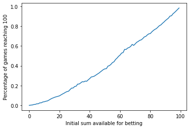

*On the stupid and less stupid ways of making money through horse races*

Photo by Jonathan Petersson on Unsplash

 

## Quick story

In my early 20s I fell into a dumb trap.

Somewhere on the internet I had bumped into one of those "one weird tricks found by a single mom in your area." The trick itself
was presented as a fresh, unknown and logic-tight method to win at the horse races. I later came to find out that that trick had actually been around since the XVIIIth century (fresh indeed) and had been debunked by a mathematician, Joseph L. Doob, about 60 years ago.

The trick went like that:

> - Find a bet that, if won, would double your ante
> - Bet one unit on this game
> - If you lose, keep finding other similar bets and bet until you win, each time betting twice the amount you previously bet
> - If you win, return to the first step

The naive idea was that even if you would lose n bets, having successively yet unsuccessfully bet 1 dollar, 2 dollars, 4 dollars... \\( 2^{n-1} \\) dollars, the sum of those bets equal \\( 2^n -1 \\) (finite geometric series), so that by finally betting \\( 2^n \\) and winning twice that, the net gain from this series of bet would be \\( -(2^n - 1) - 2^n + 2\cdot 2^n = 1 \\). **With this strategy, you always end up winning one dollar, no matter what!**

Terms and conditions apply, of course. I logged onto a registered online betting website and started applying the method. And I won. And I won. And I kept winning, one euro at a time. And I felt like a smart guy, having hacked the system with a fool-proof way to keep winning... until, for one series of games, I started to have to double my bets again, and again, and again, until I found myself having to bet *all my money* (a mere 100 euros, but a fortune for me at the time). That's when I realized the trap: **you need to have an infinite amount of money available to bet in order to keep applying the trick, otherwise you will eventually run into a situation where you cannot double your previous bet.**

Here's one easy way to visualize this:

I'm plotting the approximate chances of reaching 100 dollars as a function of the initial sum available to play (these chances have been computed by Monte-Carlo simulation over 10,000 games for each initial sum; I assumed a 50% chances of winning). Notice how the graph slightly curves down. If you're looking to reach the 100 dollars with a 95% confidence, you need to start with... 97 dollars! With a 3% gain that's not the most lucrative of games.

There's further problems with the application of this strategy, among others the fact that, while I assumed above a 50% chances of winning, nothing says that a horse with odds 2:1 has a 50% chances of winning. Rather, odds represent the betters' **confidence** in the horse, which might, or might not, prove justified.

## 
