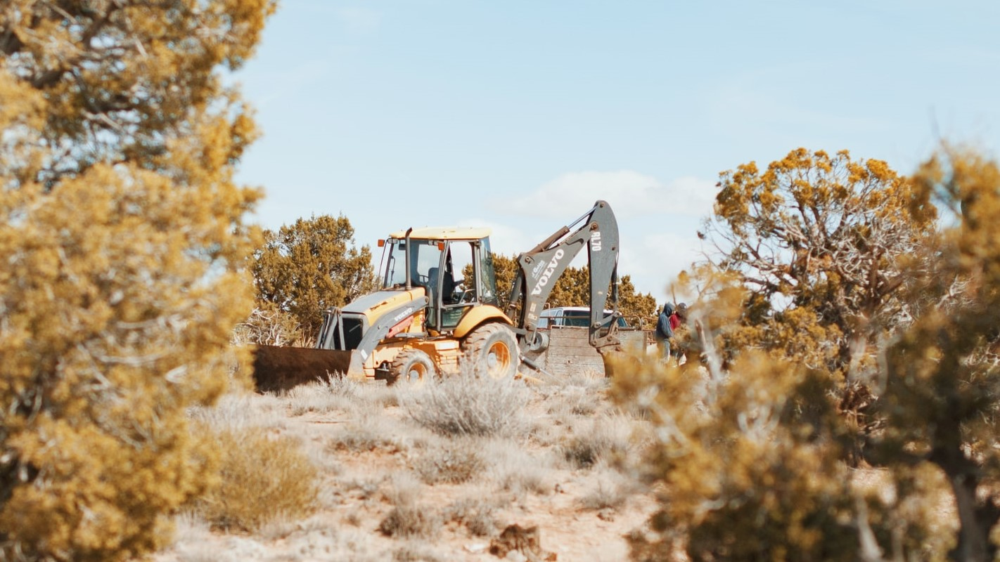

*First step of the project: collecting data and storing it in a SQL database.*

Photo by Aubrey Rose Odom on Unsplash

 

## The source

I took the data from the following website: https://www.turf-fr.com. Dozens of websites exist that repertory the results 
of French races, but I chose that one first because it seemed to have more complete information on each race, but also 
because it had a readily accessible "archive" section where one could find race results going back up to 2004 ordered 
in a HTML format that made it easier to webscrape.

## The data collected

I chose a straightforward approach for data collection, considering that more refined classifications could be made 
later on: each database entry corresponds to one horse running at one race. That means that, for a given race where, 
say, 10 horses compete, the database hosts 10 entries, one for each horse.  

**Nota bene:** the data was collected from a source written in French. I am not familiar with the English terms in 
usage, so I did my best to come up with translations, which might or might not be what English-speaking professionals 
use. I nonetheless did my best to explain what each term refers to. For bilingual readers, the French term has been included in parenthesis.

Below is a breakdown of the informations that were collected *about the horse*:

| Feature's name   | Information |
|:----------------:|-------------|
|horse_ID          |the horse's number (a form of ID for the race)|
|horse_name        |the horse's name|
|unshoed           |whether the horse is shoed or unshoed (some horses might run with horseshoes on every hoof, just on their front or rear hooves, or might not have any shoes on; considering the shoes' weight, this is sometimes believed to have an impact on the horse's performance; more details in French <a href="https://hippique.blog-pmu.fr/2015/06/11/le-deferrage/">here</a>)|
|jockeys_weight    |the jockey's weight|
|barrier           |the horse's barrier position (the equivalent of a sprinter's starting block)|
|country           |the horse's country of origin (seemingly the place of birth)|
|blinkers          |whether the horse has blinkers or not (to keep nervous horses from being influenced by peripheral presences; several types of blinkers exist the source only informs on the presence or absence of them)|
|sex               |the horse's sex: female, male, gelding (castrated males)|
|age               |the horse's age|
|jockey            |the jockey's name|
|trainer           |the trainer's name|
|average_km_timing |the horse's average timing for a km during the race|
|wins              |how much money the horse won at this race|
|former_performance|the horse's former performance (see below)|
|odds              |the odds on the horse (the ratio of total money not bet on the horse to the total money bet on the horse)|
|running           |whether the horse ends up running the race (some horses are scheduled to run but end up not running)|
|finish_position   |the horse's finishing position|

I added to these informations more info *about the race*:
|Feature's name   | Information|
|:---------------:|------------|
|race_category    |the race category (see below)|
|race_subcategory |the race subcategory (see below)|
|race_name        |the race's name|
|race_date        |the date of the race|
|race_time        |the time of the day when the race is scheduled|
|race_prize       |the race's total money prize|
|race_length      |the race's length|
|race_horse_number|the number of horses supposed to run|

Before I move on, one quick precisions on the races categories and the horse's performance.

### Races categories and subcategories

The races have been divided using two indications that I named "category" and "subcategory" even though there is no hierarchy between the two qualifiers. 

The categories of races are:
- **trotting** ("trot"), where horses run in a medium-paced gait, the trot
- **jump racing** ("obstacle"), where the horses have to race over obstacles
- **flat racing** ("plat"), where horses run full speed (gallop) between two points

The subcategories are:
- for trotting:
  - **harnessed** ("attelé"), where the horses are pulling a two-wheeled cart called sulky where the jockey sits
  - **saddled** ("monté"), where the jockey rides the horse directly
- for jump racing:
  - **hurdling** ("haies"), where the horses have to jump over meter-high obstacles made of brush, racing typically around 3 to 4kms
  - **steeplechase** ("steeple-chase"), where the horses encounter a greater variety of obstacles such as mounds, pits, water streams... and race a bit longer than for hurdling, typically more than 4kms
  - **cross-country** (same in French), where the race takes place in the open country, making use of various obstacles in the wild and extending from 5 to more than 7kms
- for flat racing there is no subcategory

### Music: the horse's past performance
For each running horse their past performance is indicated as a list of pairs of letters and numbers. In French this is
poetically refered to as the horse's "music."

Here's a few examples:
> 0a Da Da Dm 6a Da 7a 9a 2a 5a Da 6a

> 7h Ah 6p 13p 0p 6p 0p (16) 5s 9h 4s 4s 1s  

These indicate the horse's results in previous races, going from the most recent race (left) to oldest (right).

For a given pair, the first element indicates the horse's finishing position or the reason why they didn't finish, while the second element indicates the race's sub/category.

For the first element the possible characters are:
- **0** if the horse didn't finish among the first 9 horses
- **1 to 9** to represent the finishing position of the horse
- **A** if the jockey decided to stop ("arrêté") the horse mid-race
- **D** if the horse was disqualified ("disqualifié") for not adopting the required pace; this only applies to trotting races
- **R** ("rétrogradé") if the race's result were revised by the judges because the horse obstructed another horse's way
- **T** if the horse fell ("tombé")

For the second element:
- **a** for harnessed trot
- **m** for saddled trot
- **h** for hurdling
- **s** for steeplechase
- **c** for cross-country
- **p** for flat racing

## Scraping strategy

In general I decided to take the content of 
