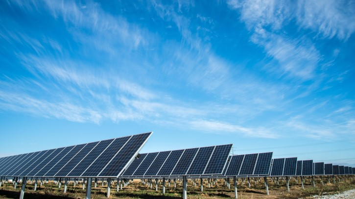

<h1><b>S2DS x EPRI: solar farm project</b></h1>
 

How fast does electricity production decrease in solar farms? A neural network approach.

 

Photo by the American Public Power Association on Unsplash

 

<h2> In 60s or less:</h2>
  
As part of the <a href="http://www.s2ds.org/">S2DS</a> bootcamp/hackaton, in partnership with the <a href="https://www.epri.com/">Electric Power Research Institute</a> (EPRI), I worked within a team of 5 to quantify the decrease over time of the capacity of a solar farm to produce electricity. This post presents the problem statement and my own contributions to this team project, mainly:

<ul>
    <li>Perform a thorough analysis of the data provided by EPRI, and detect anomalies that allowed EPRI to revise their solar farm simulations (from which the data was produced);</li>
    <li>Develop a neural network (NN) that quantifies the deterioration of electricity production due to material ageing with an accuracy 5 times greater than the industry's current tools;</li>
    <li>Present a layman-accessible introduction to the business and technical case of the project to other businesses partnering with the S2DS bootcamp.</li>
  </ul>

### The business case
Solar energy currently accounts for the largest investment worldwide in means of energy production, and is expected to be the world’s first source of electricity by 2050. Given the skyrocketing interest in this domain, we need solutions that guarantee the smallest risk in investment and the highest accuracy in ROI.

The performance of solar farms, as with any other piece of electric equipment, declines over time. This can be due to factors such as the natural ageing of the material, dirt and snow damaging the photovoltaic cells, or yet some other reasons. But solar-generated electricity is a young commercial practice (95% of solar farms having been active for less than 10 years), so we don't know much about how badly those factors affect electricity generation. Does recurrent snowing cause a 1% decrease in production every year? Or 5%? Which material could handle best, over the span of 20 years, a monthly dust storm followed by thorough cleaning? Those are the things we want to know with as much precision as possible. This information is crucial to the industry: it is estimated that **80 million dollars** could be saved **each year** by having an accurate estimate of the long-term impact on electricity production of weather, dust and material used.

To respond to this demand, our team was asked to come up with methods that analyze the amount of electricity produced over time at a given solar farm, and return a history over the same period of time of two indexes representing the impact on electricity production of, respectively, the material's natural ageing, and the dirt on photovoltaic cells. Once developed, these methods could be applied to existing solar farms so as to classify them according to these indexes, see which solar farms deteriorate more quickly, and identify common factors among worst-performing solar farms.

### Team work and personal contribution

The team used an agile development approach, holding scrum meeting every morning, meeting with a technical contact from EPRI in the afternoon. Each member focused on a task, with occasional collaborations when a task needed several pairs of hands. The team's approach was to explore a variety of techniques and tools (Facebook's Prophet, Unobserved Components, ARIMA, EEMD...) aimed at time series analysis, and single out which technique could hold the best results.

#### Data Analysis

As stated above, the mission was to develop a model that takes as input a time series of the electricity production of a solar farm. For that purpose we received data from our technical partner at EPRI of such time series, not measured on actual solar farms but created by software simulation. This allowed us to start with naively simple data and gradually increase its complexity: first ignoring all degradation effects except the material's ageing, then including damages due to dirt, then including variations due to weather.

Any proper data science project begins with a thorough data analysis, a task I picked up. I wrote a 22-page-long report on everything the team knew about the data, including the way it was generated and the various features of the time series (definition, units, format, etc.). I included plots over all datasets of basic properties of the features for each time series (min, max, mean, standard deviation...), and also a few examples, over various time scales, of those features (for instance, electricity production over a day, over a week, over a month, etc.).

Besides compiling a report that my teammates could refer to for any question regarding the data, I also uncovered the following errors in the data:
- In the features related to weather at the solar farm's location, temperatures ranged from 0°C to 80°C (32F to 176F for our American friends), while the wind speed ranged from -25m/s to 40/ms. These bizarre values led me to realize that the labels of the temperature and wind speed features had been mistakenly swapped.
- In the solar farm simulations that included the effects of weather, some simulations generated solar farms that would not produce any electricity for whole weeks, an unimaginable scenario given that even a week of thick clouds would allow solar farms to generate a minimum of electricity.

Both of those errors were promptly reported to our EPRI partners who corrected their data-generating process. The newly created data was checked once more, and found free of those errors.

#### Neural network model

Next, I developed a neural network model that could disaggregate the material's ageing from the solar farm's elecricity production.

Why neural networks? For one, these have been successfully applied in the past to deal with time series, using a variety of architectures (ANN, CNN, RNN...). More personally, I was curious about this technique and wanted to seize the opportunity of this bootcamp to explore in depth the possibilities of this tool.

Given the short amount of time that we had to achieve our goal, I took a quick-and-dirty approach rather than a slow-and-thorough one. For example, I noticed that 5-fold cross-validation returned me a RMSE on the model with a relatively low standard deviation, and thereafter decided to evaluate models on one training instead of 5 and postpone the 5-fold cross-validation up to the time when accurate RMSE would have to be reported. Another example is the number of layers chosen for the neural networks: instead of running time-costly grid searches or randomized searches for each model, I tested a few number of layers and stuck with the number that roughly gave the best accuracy-to-training-time ratio. In short, I gave priority to a timely delivery of a proof of concept.

I considered several structures, mainly artificial NN (stacks of dense layers), convolutional NN and some variations (WaveNet), and recurrent NN. RNN were excluded because they are limited in the number of time steps they can handle and we wanted to keep a time-series resolution of daily frequency, leading to about 2000 time steps per series. CNN and WaveNet were considered but seemed like they were returning results of precision comparable to ANN while requiring longer training time.

### Code
[The code is here](https://github.com/Rufski/S2DS_EPRI)

