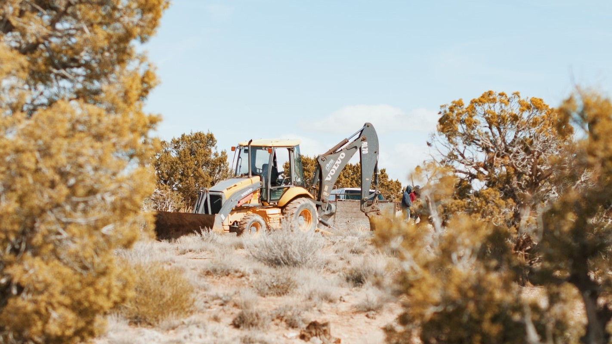

*First step of the project: collecting data and storing it in a SQL database.*

Photo by Aubrey Rose Odom on Unsplash

 

## The source

I took the data from the following website: https://www.turf-fr.com. Dozens of websites exist that repertory the results of French races, but I chose that one first because it seemed to have more complete information on each race, but also because it had a readily accessible "archive" section where one could find race results going back up to 2004.

## The data collected

I chose a straightforward approach for data collection, considering that more refined classifications could be made later on: each database entry corresponds to one horse running at one race. That means that, for a given race where, say, 10 horses compete, the database hosts 10 entries, one for each horse.  

Below is a breakdown of the informations that were collected:
-  
